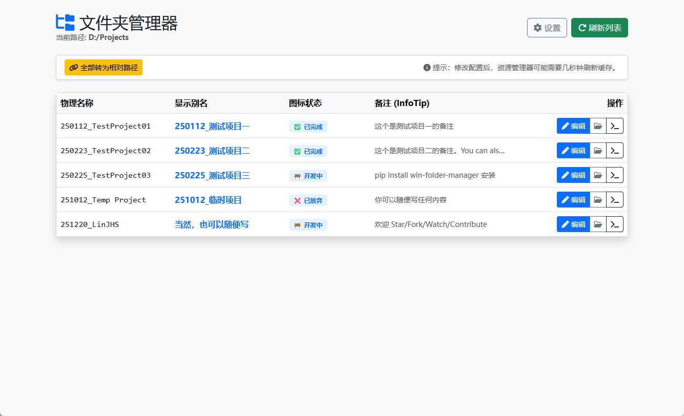
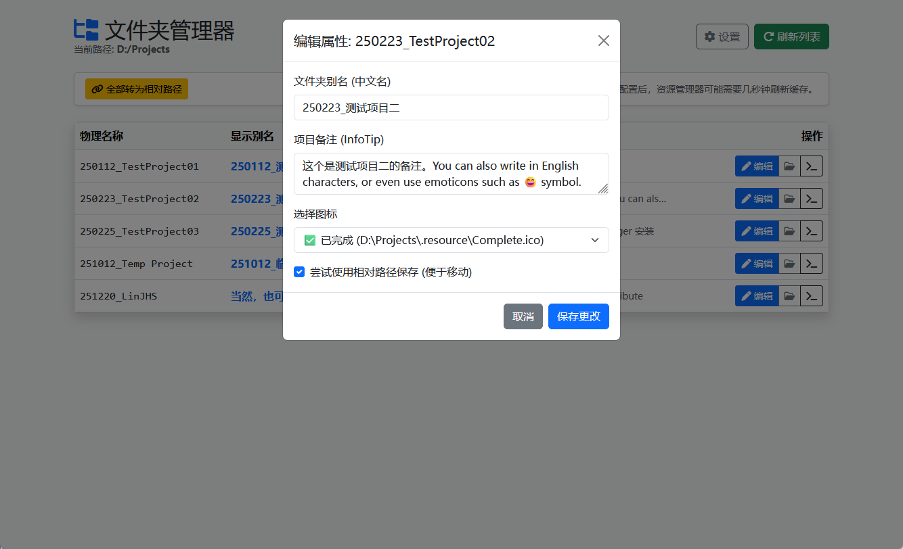
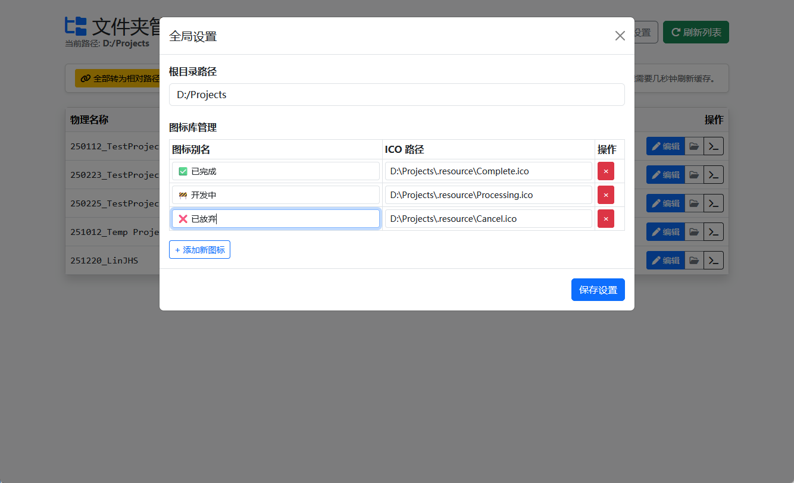
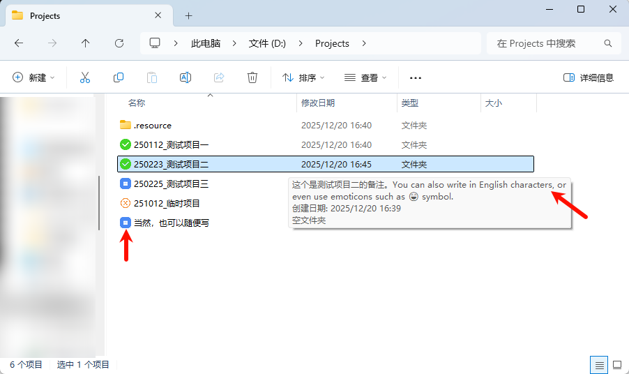

# Win Folder Manager

<div align="center">

[](https://pypi.org/project/win-folder-manager/)
[](https://hub.docker.com/r/linjhs/win-folder-manager)
[](https://github.com/LinJHS/win-folder-manager/actions)
[](https://pypi.org/project/win-folder-manager/)
[](https://github.com/LinJHS/win-folder-manager/blob/main/LICENSE)

**A lightweight, web-based manager for Windows folder customization.**

[中文文档](README.md) | [Wiki](https://github.com/LinJHS/win-folder-manager/wiki) | [Features](#-features) • [Installation](#-installation) • [Usage](#-usage) • [Docker](#-docker-support) • [Development](#-development)

</div>

---

**Win Folder Manager** allows you to easily customize Windows folders through a clean Web UI. Set custom icons, aliases (localized names), and info tips without manually editing hidden system files.

## ✨ Features

- 🖼️ **Custom Icons**: Easily set folder icons (supports absolute and relative paths).
- 🏷️ **Folder Aliases**: Rename folders visually in Explorer without changing the actual directory name.
- ℹ️ **Info Tips**: Add custom hover text descriptions to folders.
- 🔄 **Batch Operations**: Convert absolute icon paths to relative paths in batch for portability.
- 📂 **Quick Actions**: Open folders in Explorer or CMD directly from the UI.
- 🚀 **Web Interface**: Simple Flask-based UI accessible from your browser.
- 💾 **Persistent Config**: Configuration saved automatically in `%APPDATA%`.

## 📸 Screenshots

| Home Dashboard | Edit Attributes |
| :---: | :---: |
|  |  |
| **Configuration** | **Explorer Preview** |
|  |  |

## 📦 Installation

### via PyPI (Recommended)

```bash
pip install win-folder-manager
```

### via Source

```bash
git clone https://github.com/LinJHS/win-folder-manager.git
cd win-folder-manager
pip install .
```

> **Note**: If you are developing on Linux or Docker, use `requirements-docker.txt` to avoid `pywin32` installation errors:
> ```bash
> pip install -r requirements-docker.txt
> ```

## 🚀 Usage

Once installed, simply run:

```bash
win-folder-manager
```

Or using the python module directly:

```bash
python -m manager
```

The application will start a local web server (default: `http://127.0.0.1:6800`) and automatically open your default browser.

### Command Line Options

You can customize the startup behavior with the following arguments:

- `-p`, `--port`: Specify the server port (default: 6800)
- `--host`: Specify the host to bind to (default: 127.0.0.1)
- `--no-browser`: Do not open the browser automatically on start
- `--debug`: Run in Flask debug mode

Examples:

```bash
# Run on port 9000
win-folder-manager -p 9000

# Allow external access
win-folder-manager --host 0.0.0.0

# Start server only, without opening browser
win-folder-manager --no-browser
```

### Configuration

The configuration file is stored at:
`%APPDATA%\win-folder-manager\config.json`

You can configure the root path to scan for folders directly in the Web UI.

## 🐳 Docker Support

You can run Win Folder Manager using Docker.

```bash
docker run -d \
  -p 6800:6800 \
  -v /path/to/your/folders:/data \
  -v win-folder-manager-config:/root/.config/win-folder-manager \
  linjhs/win-folder-manager
```

> **Note**: This application relies on Windows-specific commands (`attrib`) to set folder attributes (System/Hidden/ReadOnly) which are required for `desktop.ini` customizations to take effect. Running this in a Linux container may limit functionality unless used in a specific environment or for viewing purposes.

## 🛠️ Development

1. Clone the repository
   ```bash
   git clone https://github.com/LinJHS/win-folder-manager.git
   ```
2. Install dependencies
   ```bash
   pip install -r requirements.txt
   ```
3. Run locally
   ```bash
   python -m manager
   ```

## 📄 License

This project is licensed under the GNU General Public License v3.0 - see the [LICENSE](LICENSE) file for details.
